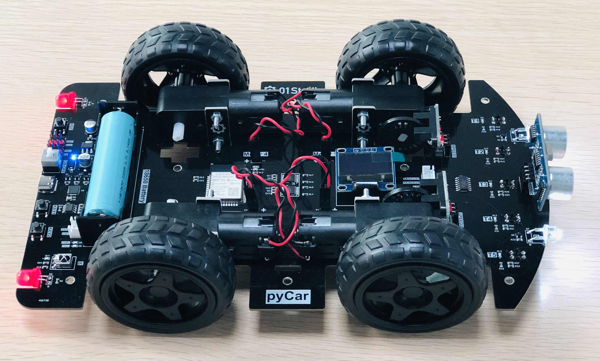

.. _pyCar_quickref:

pyCar用户手册
=============================

硬件资源
---------

* `pyCar 原理图 <https://www.01studio.cc/data/sch/pyCar_Sch.pdf>`_ (PDF)

组装pyCar
------------
- 组装教程：https://bbs.01studio.cc/thread/156

MicroPython学习
-----------------
pyCar是基于MicroPython实现，如果你没使用过MicroPython，请下载教程先学习相关知识:

https://download.01studio.cc/zh_CN/latest/micropython/pyWiFi-ESP32/pyWiFi-ESP32.html

构造函数
------------

.. class:: car.CAR(None)

    构建小车对象。
	
示例::

    import car
	
    Car = car.CAR()  #构建pyCar对象

动作
-----

.. method:: CAR.forward()

    前进。

.. method:: CAR.backward()

    后退。

.. method:: CAR.turn_left(mode=0)

    左转:
   
	- ``mode`` 转动模式：
	
		- ``0`` - 小幅度转动，单排轮子工作；
		- ``1`` - 大幅度转动，双排轮子同时工作，可实现原地旋转功能；	

.. method:: CAR.turn_right(mode=0)

    右转:
   
	- ``mode`` 转动模式：
	
		- ``0`` - 小幅度转动，单排轮子工作；
		- ``1`` - 大幅度转动，双排轮子同时工作，可实现原地旋转功能；

.. method:: CAR.stop()

    停止。
	
	
车头灯
---------
.. method:: CAR.light_on()

    打开车头灯。

.. method:: CAR.light_off()

    打开车头灯。

.. method:: CAR.light(value=0)

    车头灯开关设置:
   
	- ``value`` 开关设置值：
	
		- ``0`` - 关闭；
		- ``1`` - 打开。

超声波测距
------------
.. method:: CAR.getDistance()

    返回车头超声波传感器距离值，单位cm。

行驶路程
---------------
.. method:: CAR.getJourney()

    返回已行驶路程，单位m。

.. method:: CAR.journey_clear()

    行驶路程清零。
	
	
光电传感器
---------------

.. method:: CAR.T1()

    返回光电传感器T1值，布尔类型。

.. method:: CAR.T2()

    返回光电传感器T2值，布尔类型。

.. method:: CAR.T3()

    返回光电传感器T3值，布尔类型。

.. method:: CAR.T4()

    返回光电传感器T4值，布尔类型。

.. method:: CAR.T5()

    返回光电传感器T5值，布尔类型。
	

红外遥控器
---------------
.. method:: CAR.getIR()

    返回红外解码按键值。连续按下的情况在返回1次值后会一直返回 'REPEAT' 字符。
	
WiFi连接
----------

The :mod:`network` module::

    import network

    wlan = network.WLAN(network.STA_IF) # 创建 station 接口
    wlan.active(True)       # 激活接口
    wlan.scan()             # 扫描允许访问的SSID
    wlan.isconnected()      # 检查创建的station是否连已经接到AP
    wlan.connect('essid', 'password') # 连接到指定ESSID网络
    wlan.config('mac')      # 获取接口的MAC地址
    wlan.ifconfig()         # 获取接口的 IP/netmask(子网掩码)/gw(网关)/DNS 地址

    ap = network.WLAN(network.AP_IF) # 创捷一个AP热点接口
    ap.config(essid='ESP-AP') # 激活接口
    ap.config(max_clients=10) # 设置热点允许连接数量
    ap.active(True)         # 设置AP的ESSID名称

连接到本地WIFI网络的函数参考::

    def do_connect():
        import network
        wlan = network.WLAN(network.STA_IF)
        wlan.active(True)
        if not wlan.isconnected():
            print('connecting to network...')
            wlan.connect('essid', 'password')
            while not wlan.isconnected():
                pass
        print('network config:', wlan.ifconfig())

一旦网络建立成功，你就可以通过 :mod:`socket <usocket>` 模块创建和使用 TCP/UDP sockets 通讯,
以及通过 ``urequests`` 模块非常方便地发送 HTTP 请求。

